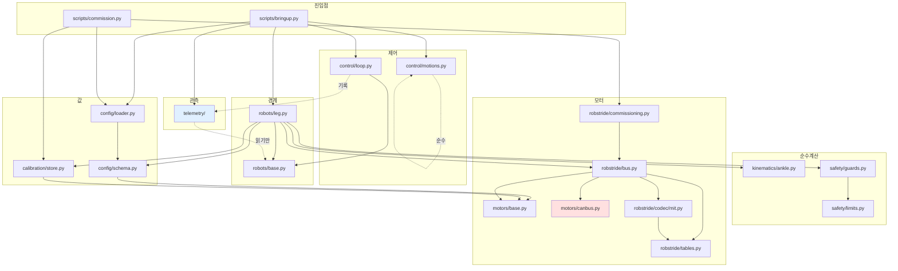
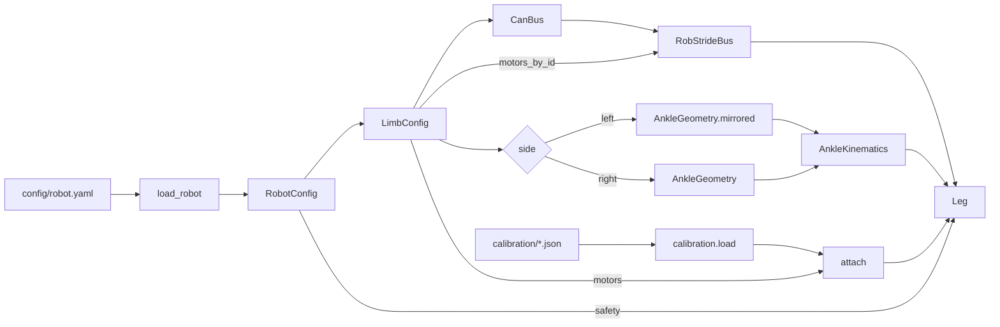
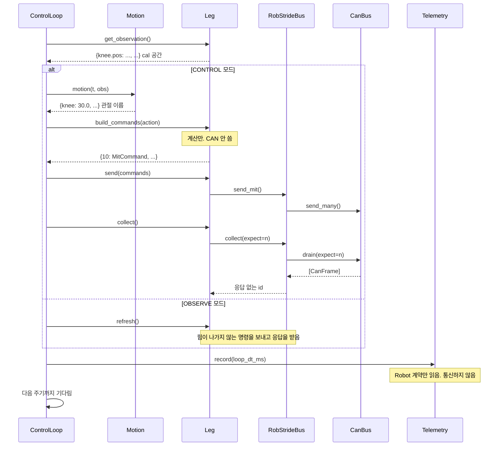
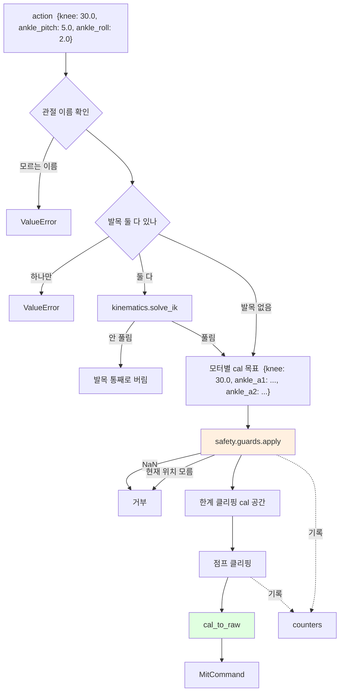
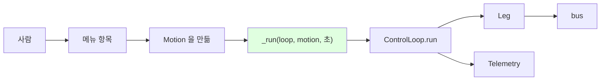
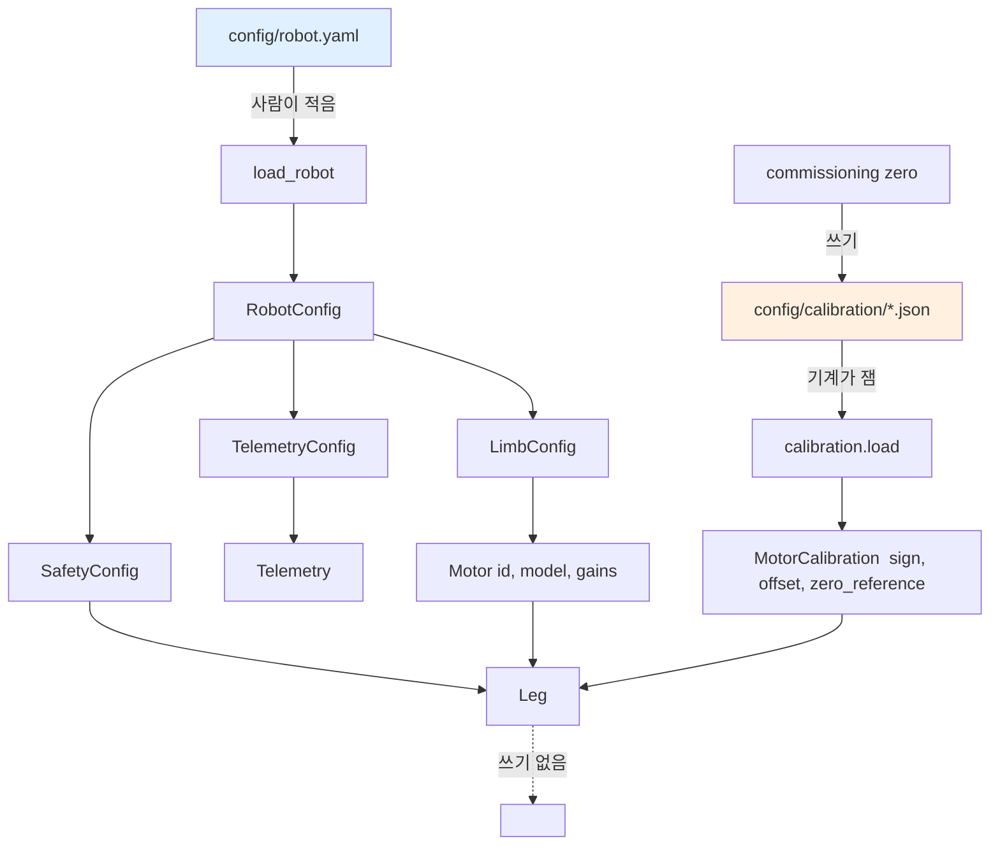
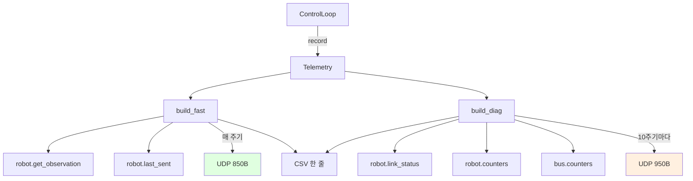
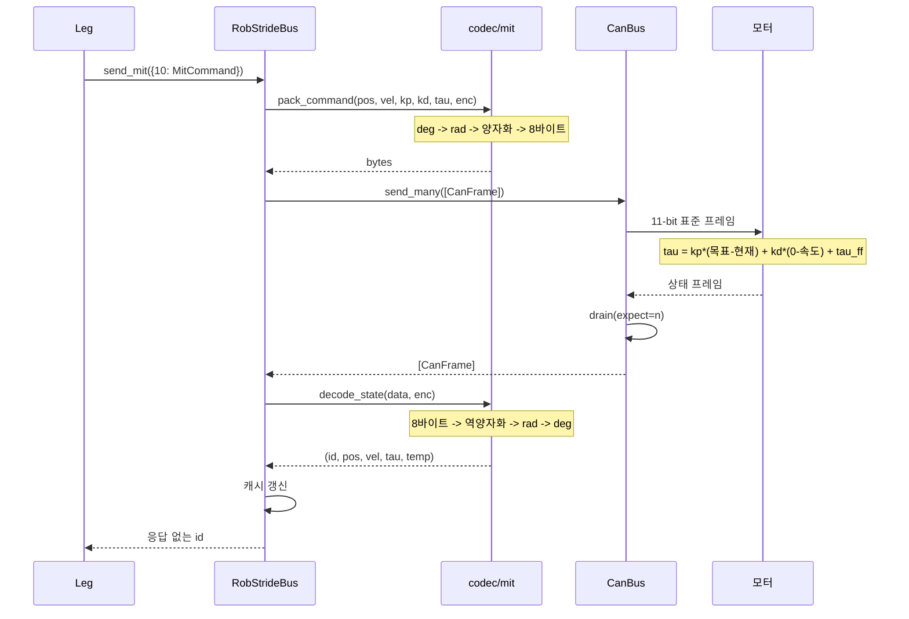

# 호출 관계와 흐름도

누가 누구를 부르는지. 계층을 나눈 **이유**는 [architecture.md](architecture.md),
사용법은 [루트 README](../README.md).

---

## 1. 모듈 의존 그래프



**`canbus.py` 만 `python-can` 을 씀** (붉은색). 그것도 함수 안에서 import 함.

**`telemetry/` 는 아무도 부르지 않음** (파란색). `Robot` 계약을 읽기만 함.

---

## 2. 조립 — `bringup.build_leg()`



`motors_by_id()` 가 경계임 — **여기서 관절 이름을 버리고 모터 id 만 넘김.**
`RobStrideBus` 는 "무릎" 이 무엇인지 모름.

`attach()` 도 같음 — 관절 이름 키의 캘리브레이션을 모터 id 키로 다시 잡음.
양쪽 관절 이름이 정확히 같아야 하고, 하나만 빠져도 에러임.

---

## 3. 제어 한 사이클 — `ControlLoop.step()`



**관찰 모드도 통신을 함.** MIT 프로토콜에는 읽기 전용 명령이 없어서, 아무것도
보내지 않으면 아무것도 오지 않음.

---

## 4. `build_commands()` 내부 — 관절에서 프레임까지



**검사가 변환보다 먼저임.** 한계가 cal 공간에 있으므로 raw 로 내린 뒤 검사하면
`sign` 이 -1 인 관절에서 부호가 뒤집혀 한계가 반대로 걸림.

**발목의 두 실패가 다름.** IK 가 안 풀리면 통째로 버리고, 한계에 잘리는 것은
개별로 처리함 — 잘린 각도 쌍도 대응하는 발 자세가 있음.

---

## 5. 브링업 메뉴 경로



**메뉴가 로봇을 직접 부르지 않음.** 동작만 정하고 루프에 넘김.

직접 부르면 그 경로에서만 텔레메트리·주기 측정·정지 순서가 빠짐. 그러면 그래프가
안 나오는데 텔레메트리가 고장난 줄 알게 됨 ([이슈 #4](issues.md)).

테스트가 `ControlLoop.run` 을 감시해 이것을 고정함.

### 커미셔닝은 루프를 타지 않음


영점·CAN id·프로토콜은 **반복하지 않는 조작이라 주기가 없음.** 되돌리기 어려워서
`--yes` 를 요구하고, 승인 확인이 버스를 열기 전에 일어남.

---

## 6. 설정과 실측값



**제어 경로는 읽기만 함.** 쓰기는 커미셔닝에서만 일어남 — 제어 중에 실측값이
바뀌면 좌표계가 도중에 옮겨감.

두 파일을 나눈 이유: `robot.yaml` 은 주석이 많아 **프로그램이 다시 쓰면 주석이
날아감.** 그래서 프로그램은 JSON 만 씀. 사람이 손으로 적는 값(id, model, 게인)만
`robot.yaml` 에 있음.

---

## 7. 텔레메트리 경로



**필드 이름을 정하는 곳이 하나임.** UDP 와 CSV 가 같은 사전을 소비함.

**패킷을 둘로 나눔.** 합치면 66필드 약 1.8 KB 로 MTU(1500)를 넘어 조각나고, 조각
하나만 잃어도 패킷 전체가 버려짐.

CSV 는 안 나눔 — 크기 제약이 없고 한 줄에 다 있어야 대조하기 쉬움.

### 양다리

```
Telemetry(left_leg)   -> 패킷 둘
Telemetry(right_leg)  -> 패킷 둘
```

합쳐 보내지 않음. `merge()` 는 CSV 전용임.

---

## 8. CAN 한 왕복



**응답이 곧 ack 임.** MIT 모드는 명령을 받으면 반드시 답하므로, 안 오면 그 모터가
명령을 처리하지 않은 것임.

CAN 하드웨어 ACK 는 버스의 아무 노드나 찍어주므로 "누군가 들었다" 일 뿐임 —
그건 `tx_errors` 가 봄.

### 프레임 배치

```
명령 (Command 3)                    응답 (Response Command 1)
Byte0~1              목표각 16bit   Byte0                모터 CAN ID
Byte2 + Byte3[7:4]   목표속도 12bit  Byte1~2              현재각 16bit
Byte3[3:0] + Byte4   Kp     12bit   Byte3 + Byte4[7:4]   현재속도 12bit
Byte5 + Byte6[7:4]   Kd     12bit   Byte4[3:0] + Byte5   현재토크 12bit
Byte6[3:0] + Byte7   목표토크 12bit  Byte6~7              온도
```

**배치가 다름** — 응답은 앞에 모터 ID 가 붙어 한 칸씩 밀림.

---

## 9. 한눈에

| 계층 | 무엇을 하나 | 무엇을 모르나 |
|---|---|---|
| `scripts/` | 사람의 입력을 동작으로 | 프레임, 바이트 |
| `control/` | 주기, 모드, 시작·종료 순서 | 관절 이름, 모터 |
| `robots/` | 관절 ↔ 모터, cal ↔ raw, 안전 | 바이트 |
| `kinematics/` | 발목 pitch/roll ↔ a1/a2 | 모터, CAN |
| `safety/` | 한계·점프·NaN 검사 | 좌표계가 무엇인지 |
| `config/` | 설정 읽기 | 모터, CAN |
| `calibration/` | 실측값 읽기·쓰기 | 모터, CAN |
| `motors/base` | 벤더 중립 자료형 | 프레임 배치 |
| `robstride/` | 벤더 사양, 코덱, 버스 | 관절 이름 |
| `canbus/` | 8바이트 송수신 | 바이트의 뜻 |
| `telemetry/` | 관찰 | 제어에 끼어들지 않음 |
