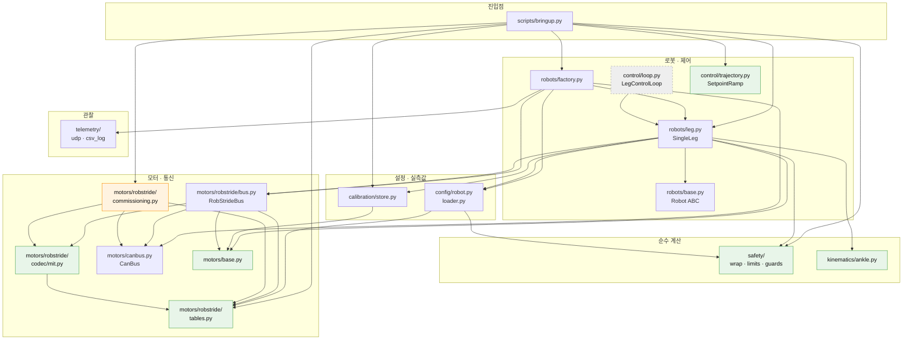
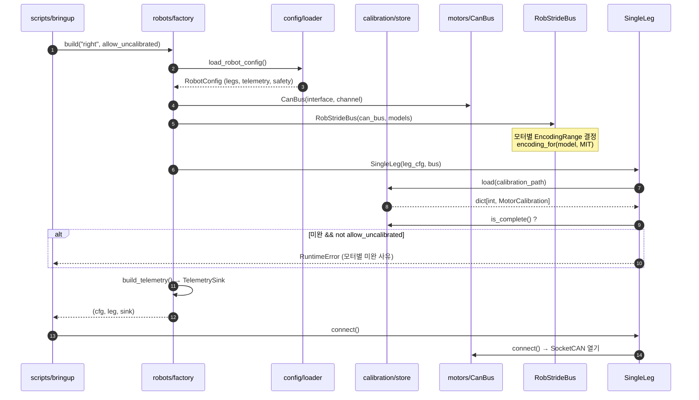
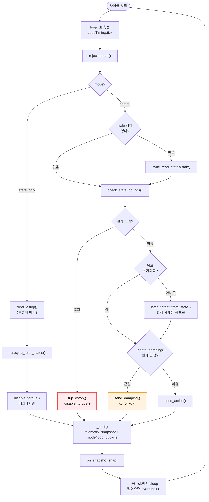
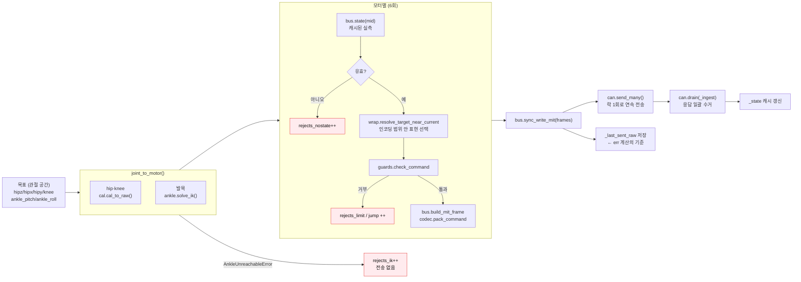
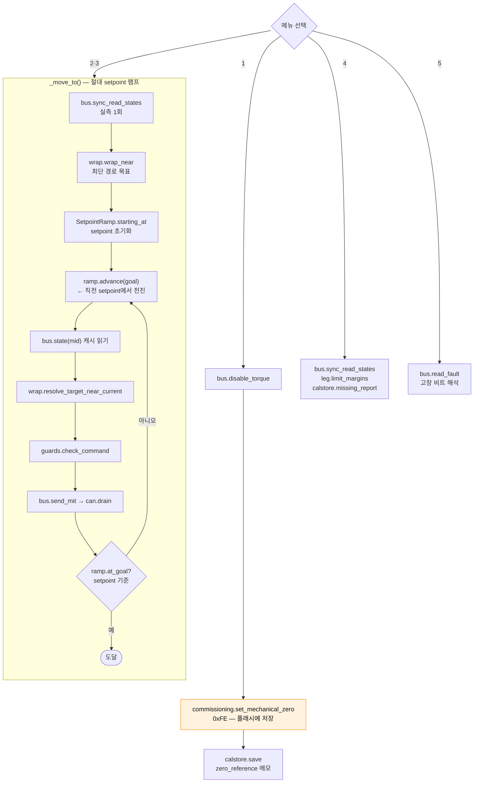
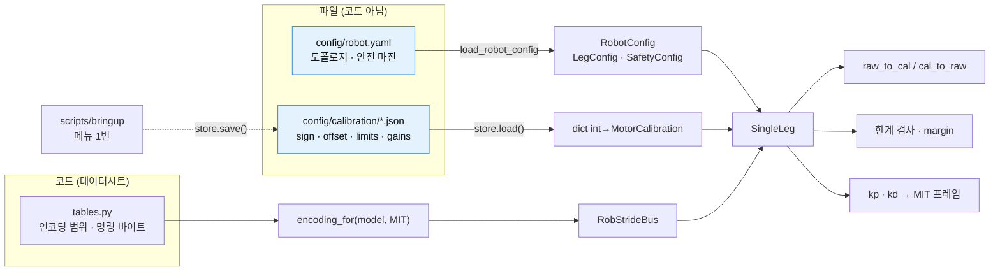
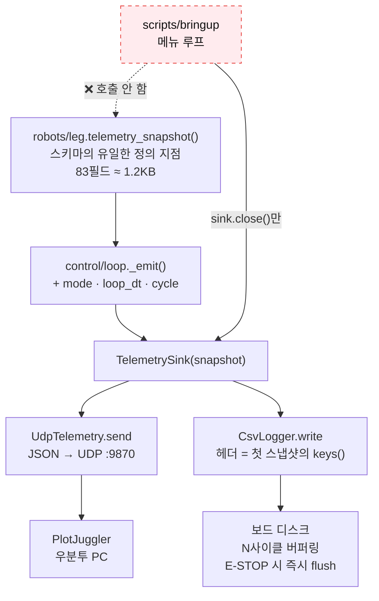
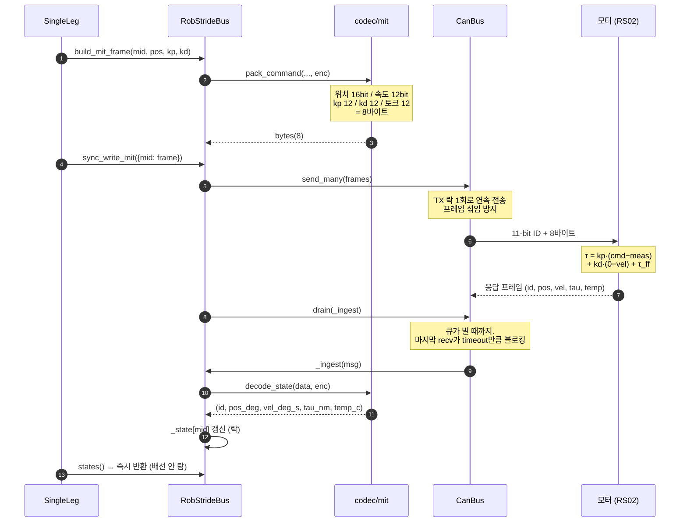
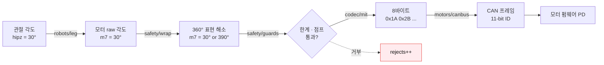

# 호출 관계와 흐름도

`src/huphy/`의 구조를 그림으로. 소스에서 추출한 실제 import 관계와 호출 순서다.

> GitHub에서는 바로 렌더링된다. VSCode에서 보려면 Markdown Preview Mermaid Support
> 확장이 필요하다.

---

## 1. 모듈 의존 그래프 (정적)

화살표 = **"A가 B를 import한다"**. 의존은 위에서 아래로만 흐른다.

| 표시 | 의미 |
|---|---|
| 🟩 초록 | **순수 계층** — `python-can` 없이 import·테스트된다 |
| 🟧 주황 | **커미셔닝** — 되돌리기 어려운 영구 조작. `scripts/`만 부른다 |
| ⬜ 점선 | **미연결** — 아직 아무도 import하지 않는다 |

**규칙 확인**: `safety/`·`kinematics/`가 `motors/`를 가리키는 화살표가 없고,
`telemetry/`에서 나가는 화살표가 하나도 없다. `motors/`에서 위로 올라가는 화살표도 없다.

---

## 2. 조립 순서 — `build()`가 하는 일

---

## 3. 제어 한 사이클 — `LegControlLoop.step()`

**`update_damping()`이 하나라도 걸리면 다리 전체가 감쇠로 간다.** 범인 모터는
`_damping_culprit`에 기록되어 스냅샷으로 나간다.

---

## 4. `send_action()` 내부 — 관절 공간에서 CAN 프레임까지

> `_last_sent_raw`가 **실제로 프레임에 실린 값**이다. `err = tgt − pos`의 `tgt`가
> 이것이어야 모터 펌웨어 PD가 보는 오차와 일치한다.

---

## 5. 브링업 메뉴 경로 — 지금 실제로 도는 것

⚠️ **메뉴는 §3, §4를 거치지 않는다.** 버스를 직접 호출한다.

**§4와 비교했을 때 빠지는 것**: 관절 공간 변환, 발목 IK, `rejects` 집계,
`telemetry_snapshot`. 메뉴는 모터 하나만 다루므로 관절 공간이 필요 없어서인데,
그 결과 텔레메트리가 흐르지 않는다.

---

## 6. 데이터 흐름 — 설정과 캘리브레이션

**쓰기가 일어나는 유일한 곳은 `scripts/`다.** 런타임 제어 경로는 읽기만 한다.

---

## 7. 텔레메트리 경로 — 그리고 끊긴 지점

**`control/loop.py`를 아무도 쓰지 않으므로 이 경로 전체가 아직 안 돈다.**
`factory.build()`가 `TelemetrySink`를 만들지만 `bringup.py`는 `close()`만 부른다.

잇는 방법 두 가지:
1. `_move_to` 루프 안에서 `leg.telemetry_snapshot()`을 만들어 sink로
2. 메뉴를 `LegControlLoop` 기반으로 다시 쓰기

---

## 8. CAN 프레임 한 왕복

**상태 읽기가 O(1)인 이유**: `states()`는 캐시를 읽을 뿐 버스로 나가지 않는다.
다만 캐시를 **채우는** `drain()`이 현재는 제어 루프 안에서 돈다
(→ [motors/README.md](../src/huphy/motors/README.md)의 RX 3단계).

---

## 9. 한눈에 — 계층별 책임

각 화살표가 한 계층이다. **위로 갈수록 사람의 언어, 아래로 갈수록 기계의 언어.**
