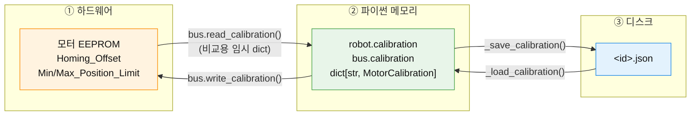
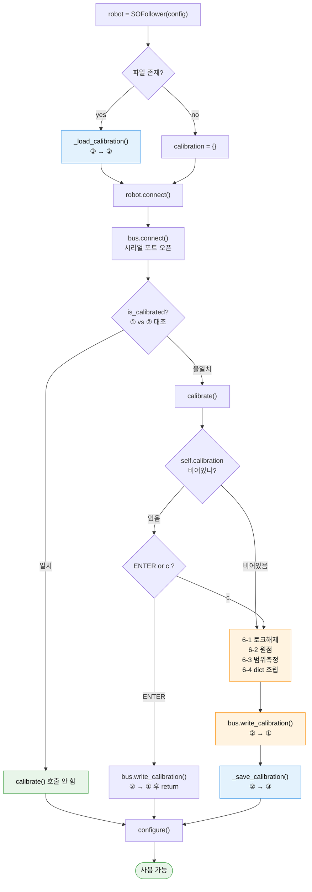

# LeRobot 캘리브레이션 — 전체 동작 원리

LeRobot에서 캘리브레이션이 **무엇을 하고, 어디에 저장되고, 언제 실행되는지**를
코드를 따라가며 정리한 문서.

경로는 전부 `lerobot/src/lerobot/` 기준이며, 문서에서는 `src/lerobot/`으로 줄여 쓴다.
HUPHY와의 차이는 §10에 정리했다.

---

## 0. 한 문장 요약

캘리브레이션이란 **"모터가 뱉는 raw 엔코더 값(0\~4095 tick)"과 "정책이 쓰는 의미 있는 값
(-100\~100, 0\~100, degree)"을 이어주는 변환표**를 만들고,
그걸 ①모터 EEPROM ②파이썬 메모리 ③디스크 JSON 세 곳에 심어두는 과정이다.

---

## 1. 왜 필요한가

Feetech STS3215 같은 스마트 서보는 위치를 **12비트 정수(0\~4095 tick)** 로 보고한다.
그 자체로는 의미가 없다.

- 모터 혼(horn)을 어느 각도로 끼웠느냐에 따라 "팔이 똑바로 선 자세"의 tick이 매번 다르다
  → **원점이 제각각**
- 관절마다 물리적 가동범위가 다르다 (어깨 240°, 그리퍼 40°)
  → **범위가 제각각**
- 같은 기종 두 대라도 조립 편차가 있다
  → **A에서 학습한 정책이 B에서 안 먹힘**

그래서 정책이 다루는 값은 raw tick이 아니라 정규화된 값이어야 한다.

```
"어깨를 가동범위 정중앙으로"  →   0.0     (-100 ~ 100)
"그리퍼 완전히 열기"         → 100.0     (  0 ~ 100)
```

이 변환에 필요한 **관절별 min/max tick + 원점 오프셋**이 곧 캘리브레이션 데이터다.

리더–팔로워 텔레오퍼레이션이 작동하는 원리이기도 하다. 물리적으로 다른 두 기계가
캘리브레이션을 거치면 "가동범위의 몇 %"라는 공통 언어를 갖게 되고,
리더의 `-100~100` 값을 그대로 팔로워에 넣으면 같은 자세가 나온다.

---

## 2. 데이터의 실체 — `MotorCalibration`

`src/lerobot/motors/motors_bus.py:175`

```python
@dataclass
class MotorCalibration:
    id: int             # 모터의 버스 상 ID (1~6 등)
    drive_mode: int     # 0 or 1. 1이면 방향 반전 (좌우 대칭 팔 등)
    homing_offset: int  # 원점 보정값 (raw tick)
    range_min: int      # 이 관절이 실제로 갈 수 있는 최소 tick
    range_max: int      # 최대 tick
```

로봇 하나의 캘리브레이션 = 이 dataclass의 딕셔너리.

```python
dict[str, MotorCalibration]   # 모터이름 → 캘리브레이션
```

---

## 3. 세 개의 저장소

같은 내용이 **세 군데에 복제**되어 존재한다. 이걸 구분해야 코드가 읽힌다.

| | 위치 | 실체 | 전원 끄면 | 역할 |
|---|---|---|---|---|
| **①** | 모터 EEPROM | `Homing_Offset`, `Min_Position_Limit`, `Max_Position_Limit` 레지스터 | **유지됨** | 모터 펌웨어가 직접 사용 |
| **②** | 파이썬 메모리 | `robot.calibration`, `bus.calibration` | 사라짐 | 매 프레임 정규화 계산 |
| **③** | 디스크 JSON | `<calibration_dir>/<id>.json` | 유지됨 | 다음 실행 때 ②를 복원 |



### 저장소 사이를 오가는 함수

| 함수 | 방향 | 위치 |
|---|---|---|
| `_load_calibration()` | ③ → ② | `robots/robot.py:151` |
| `_save_calibration()` | ② → ③ | `robots/robot.py:162` |
| `bus.write_calibration()` | ② → ① (+ ② 캐시 갱신) | `motors/feetech/feetech.py:268` |
| `bus.read_calibration()` | ① → 임시 dict (비교용) | `motors/feetech/feetech.py:247` |
| `bus.reset_calibration()` | ① 공장초기화 + ② 비움 | `motors/motors_bus.py:754` |

`_save_calibration()`은 **②→③ 한 방향만** 담당한다. 하드웨어는 건드리지 않는다.

```python
def _save_calibration(self, fpath: Path | None = None) -> None:
    fpath = self.calibration_fpath if fpath is None else fpath
    with open(fpath, "w") as f, draccus.config_type("json"):
        draccus.dump(self.calibration, f, indent=4)
```

### 결과 파일 예시

```json
{
    "shoulder_pan":  { "id": 1, "drive_mode": 0, "homing_offset": -1032, "range_min": 812,  "range_max": 3284 },
    "shoulder_lift": { "id": 2, "drive_mode": 0, "homing_offset": 195,   "range_min": 1024, "range_max": 3072 },
    "gripper":       { "id": 6, "drive_mode": 0, "homing_offset": -40,   "range_min": 2000, "range_max": 2600 }
}
```

---

## 4. 객체 구성 관계

```
SOFollower(Robot)                                    ← 사용자가 다루는 객체
│
├─ Robot.__init__()가 세팅:
│   ├─ self.id                = "my_arm"                       ← config.id
│   ├─ self.calibration_dir   = config.calibration_dir
│   │                            or HF_LEROBOT_CALIBRATION/"robots"/self.name
│   ├─ self.calibration_fpath = calibration_dir / "my_arm.json"    ← ③ 경로
│   └─ self.calibration       = {} 또는 _load_calibration() 결과    ← ②
│
├─ self.bus = FeetechMotorsBus(                      ← 시리얼 통신 담당
│      port="/dev/ttyACM0",
│      motors={
│          "shoulder_pan":  Motor(1, "sts3215", MotorNormMode.RANGE_M100_100),
│          ...
│          "gripper":       Motor(6, "sts3215", MotorNormMode.RANGE_0_100),
│      },
│      calibration=self.calibration,                 ← ★ ②를 그대로 넘김
│  )
│   └─ self.bus.calibration                          ← ②와 같은 dict 참조
│
└─ self.cameras = {...}
```

`src/lerobot/robots/so_follower/so_follower.py:47`

**핵심**: `Robot`이 캘리브레이션을 소유하고, `MotorsBus`가 참조해서 정규화에 쓴다.
`Motor.norm_mode`가 **어떤 공식을 쓸지**를, `MotorCalibration.range_min/max`가
**그 공식의 파라미터**를 제공한다. 둘이 한 세트다.

> ⚠️ `calibrate()` 안에서 `self.calibration = {}`로 **재할당**하면 Robot↔Bus 참조가 끊긴다.
> 그래서 바로 뒤 `bus.write_calibration(...)`의 `if cache: self.calibration = calibration_dict`가
> 참조를 다시 이어준다.

---

## 5. 경로 결정 규칙

`src/lerobot/robots/robot.py:49`

```python
self.calibration_dir = (
    config.calibration_dir if config.calibration_dir
    else HF_LEROBOT_CALIBRATION / ROBOTS / self.name    # ROBOTS = "robots"
)
self.calibration_dir.mkdir(parents=True, exist_ok=True)
self.calibration_fpath = self.calibration_dir / f"{self.id}.json"
if self.calibration_fpath.is_file():
    self._load_calibration()
```

```
~/.cache/huggingface/lerobot/calibration/robots/so_follower/my_arm.json
                                        └teleoperators/so_leader/my_leader.json
```

- 루트는 환경변수 `HF_LEROBOT_CALIBRATION`로 변경 (`utils/constants.py:77`)
- `self.name`은 클래스 변수(`"so_follower"`), `self.id`는 사용자 지정
  → **같은 기종 여러 대를 `id`로 구분**한다. `--robot.id=blue`, `--robot.id=red`
- `Teleoperator`도 동일 로직, 폴더만 `teleoperators` (`teleoperators/teleoperator.py:49`)

---

## 6. 캘리브레이션 절차 — `calibrate()`

`src/lerobot/robots/so_follower/so_follower.py`

### 6-0. 기존 파일이 있으면 먼저 물어본다

```python
if self.calibration:      # ③에서 로드된 값이 있음
    user_input = input("ENTER=기존 파일 사용, c=새로 측정: ")
    if user_input.strip().lower() != "c":
        self.bus.write_calibration(self.calibration)   # ② → ① 만 하고
        return                                          # 파일 저장 안 함
```

파일 내용이 안 바뀌므로 `_save_calibration()`을 부를 이유가 없다.

### 6-1. 토크 해제

```python
self.bus.disable_torque()
for motor in self.bus.motors:
    self.bus.write("Operating_Mode", motor, OperatingMode.POSITION.value)
```

목적이 **두 가지**다 — 손으로 관절을 움직이기 위해, 그리고 EEPROM 쓰기 잠금 해제를 위해.
Feetech는 `Lock` 레지스터로 EEPROM 쓰기를 막는데, lerobot이 토크와 함께 관리한다
(`motors/feetech/feetech.py:290`):

```python
def disable_torque(self, ...):
    self.write("Torque_Enable", motor, TorqueMode.DISABLED.value)
    self.write("Lock", motor, 0)      # ← EEPROM 쓰기 허용

def enable_torque(self, ...):
    self.write("Torque_Enable", motor, TorqueMode.ENABLED.value)
    self.write("Lock", motor, 1)      # ← EEPROM 쓰기 잠금
```

토크가 켜진 상태에서 `write_calibration()`을 부르면 EEPROM 쓰기가 무시될 수 있다.

### 6-2. 원점 잡기 — `set_half_turn_homings()`

```python
input("로봇을 가동범위 중앙 자세로 두고 ENTER....")
homing_offsets = self.bus.set_half_turn_homings()
```

내부 (`motors/motors_bus.py:789`):

```python
self.reset_calibration(motor_names)                            # ① 초기화: offset=0, limit=0~4095
actual = self.sync_read("Present_Position", normalize=False)   # 현재 raw tick
homing_offsets = self._get_half_turn_homings(actual)
for motor, offset in homing_offsets.items():
    self.write("Homing_Offset", motor, offset)                 # ① EEPROM에 씀
```

Feetech 계산식 (`motors/feetech/feetech.py:278`):

```python
# Feetech 규칙: Present_Position = Actual_Position - Homing_Offset
half_turn_homings[motor] = pos - int(max_res / 2)   # max_res = 4095 → 2047
```

**의미**: "지금 이 자세가 앞으로 2047(정중앙)로 읽히게 하라."
모터 혼을 어느 이빨에 끼웠는지에서 오는 조립 편차를 여기서 한 번에 흡수한다.

> `reset_calibration()`을 **먼저** 부르는 게 중요하다. 기존 오프셋이 남아 있으면
> `pos` 자체가 이미 보정된 값이라 계산이 중첩된다.

### 6-3. 가동범위 측정 — `record_ranges_of_motion()`

```python
print("wrist_roll 빼고 모든 관절을 끝에서 끝까지 움직이세요. ENTER로 종료")
range_mins, range_maxes = self.bus.record_ranges_of_motion(unknown_range_motors)
range_mins["wrist_roll"] = 0        # 무한회전 관절은 전체 범위로 하드코딩
range_maxes["wrist_roll"] = 4095
```

내부 (`motors/motors_bus.py:820`) — 20ms 폴링 루프다:

```python
mins = maxes = start_positions.copy()
while not enter_pressed():
    positions = self.sync_read("Present_Position", normalize=False, num_retry=5)
    mins  = {m: min(positions[m], v) for m, v in mins.items()}
    maxes = {m: max(positions[m], v) for m, v in maxes.items()}
    print(라이브 테이블)   # NAME | MIN | POS | MAX
    time.sleep(0.02)

same_min_max = [m for m in motor_names if mins[m] == maxes[m]]
if same_min_max:
    raise ValueError(...)   # 안 움직인 관절이 있으면 에러
```

두 가지를 짚어둘 만하다.

- **`normalize=False`로 읽는다.** 아직 캘리브레이션이 없으니 정규화가 불가능하다.
  정규화하려는 순간 `RuntimeError: has no calibration registered`가 난다.
  닭-달걀 문제를 `normalize=False`로 푼다.
- **실제 가동범위는 모터 스펙이 아니라 기구부 간섭으로 결정된다.** 프레임에 부딪히거나
  케이블이 걸리는 지점이 진짜 한계고, 그건 조립체마다 다르다. 그래서 스펙시트를 보고
  미리 적는 게 아니라 손으로 밀어서 **측정**한다.

### 6-4. dict 조립 → 세 곳에 배포

```python
self.calibration = {}
for motor, m in self.bus.motors.items():
    self.calibration[motor] = MotorCalibration(
        id=m.id,
        drive_mode=0,
        homing_offset=homing_offsets[motor],
        range_min=range_mins[motor],
        range_max=range_maxes[motor],
    )                                            # ← ② 완성

self.bus.write_calibration(self.calibration)     # ② → ①  (EEPROM에 씀)
self._save_calibration()                         # ② → ③  (JSON 저장)
```

`write_calibration`의 실체 (`motors/feetech/feetech.py:268`):

```python
for motor, calibration in calibration_dict.items():
    if self.protocol_version == 0:
        self.write("Homing_Offset", motor, calibration.homing_offset)
    self.write("Min_Position_Limit", motor, calibration.range_min)
    self.write("Max_Position_Limit", motor, calibration.range_max)
if cache:
    self.calibration = calibration_dict     # ★ bus의 ② 참조도 새 dict로 교체
```

**두 함수는 항상 짝으로 호출된다.** `write_calibration()`만 하면 이번엔 동작하지만
다음 실행 때 파일이 없어 또 캘리브레이션을 요구받고, `_save_calibration()`만 하면
파일만 바뀌고 하드웨어는 그대로다.

---

## 7. 언제 실행되나

### 생성자에서는 실행되지 않는다

`Robot.__init__`은 **파일 읽기만** 한다. 시리얼 포트도 열지 않는다.

```python
robot = SOFollower(config)   # ← 파일만 읽음. USB 안 꽂혀 있어도 성공한다.
```

이름이 비슷한 두 함수를 구분해야 한다.

| | `_load_calibration()` | `calibrate()` |
|---|---|---|
| 하는 일 | JSON 파일 → 파이썬 dict | 사람이 로봇을 움직여 값을 **측정** |
| 통신 | 없음 (파일 I/O만) | 시리얼 통신 필수 |
| 사용자 개입 | 없음 | `input()` 두 번 |
| 부르는 곳 | `__init__` | `connect()`, CLI |

### 경로 A — `connect()`가 자동 판단

```python
def connect(self, calibrate: bool = True) -> None:
    self.bus.connect()                          # ← 여기서 처음 시리얼 포트 열림
    if not self.is_calibrated and calibrate:    # ← 조건부
        logger.info("모터 값과 파일이 불일치하거나 파일 없음")
        self.calibrate()                        # ★ 여기
    for cam in self.cameras.values():
        cam.connect()
    self.configure()
```

`is_calibrated` 판정 (`motors/feetech/feetech.py:228`):

```python
@property
def is_calibrated(self) -> bool:
    motors_calibration = self.read_calibration()          # ① 실제 모터 상태
    if set(motors_calibration) != set(self.calibration):  # ② 파일 기준과 모터 목록 비교
        return False
    same_ranges = all(
        self.calibration[motor].range_min == cal.range_min
        and self.calibration[motor].range_max == cal.range_max
        for motor, cal in motors_calibration.items()
    )
```

**①(하드웨어)과 ②(파일에서 로드된 메모리)를 대조**한다. 이게 시리얼 통신을 요구하므로
`bus.connect()` 뒤에 있어야만 한다 — 생성자에 둘 수 없는 구조적 이유다.

불일치 케이스: ②가 비어 있음(첫 실행) / 모터 교체·공장초기화 / 다른 로봇의 파일 사용.

### 경로 B — CLI로 명시 실행

`src/lerobot/scripts/lerobot_calibrate.py`

```bash
lerobot-calibrate --robot.type=so101_follower --robot.port=/dev/ttyACM0 --robot.id=my_arm
lerobot-calibrate --teleop.type=so101_leader  --teleop.port=/dev/ttyACM1 --teleop.id=my_leader
```

```python
device.connect(calibrate=False)    # ★ 자동 호출 끄고
try:
    device.calibrate()             # 직접 호출 — 무조건 실행
finally:
    device.disconnect()
```

`calibrate=False`인 이유: `connect()` 안에서 한 번, 밖에서 또 한 번 도는 걸 막으려고.
그리고 "지금 상태가 어떻든 다시 하겠다"는 의도이므로 `is_calibrated` 판정을 우회하는 게 맞다.
팔로워/리더는 각각 따로 캘리브레이션해야 한다.

### 실측까지의 3중 관문



---

## 8. 값이 실제로 쓰이는 순간

여기가 "왜 이 고생을 했나"의 답이다.

### 관측 (읽기)

```python
obs = robot.get_observation()
#   └ self.bus.sync_read("Present_Position")      ← normalize 기본값 True
#       └ _normalize(decoded)                      motors_bus.py:1168
```

`motors/motors_bus.py:854`

```python
if not self.calibration:
    raise RuntimeError(f"{self} has no calibration registered.")   # ★ 없으면 아예 못 씀

min_ = self.calibration[motor].range_min
max_ = self.calibration[motor].range_max
drive_mode = self.apply_drive_mode and self.calibration[motor].drive_mode

bounded_val = min(max_, max(min_, val))          # 범위 밖은 클램프

if norm_mode is RANGE_M100_100:                  # 일반 관절
    norm = (((bounded_val - min_) / (max_ - min_)) * 200) - 100
    return -norm if drive_mode else norm         # drive_mode면 부호 반전
elif norm_mode is RANGE_0_100:                   # 그리퍼
    norm = ((bounded_val - min_) / (max_ - min_)) * 100
    return 100 - norm if drive_mode else norm
elif norm_mode is DEGREES:                       # use_degrees=True
    mid = (min_ + max_) / 2
    return (val - mid) * 360 / max_res
```

### 명령 (쓰기)

```python
robot.send_action({"shoulder_pan.pos": 30.0, "gripper.pos": 80.0})
#   └ self.bus.sync_write("Goal_Position", goal_pos)
#       └ _unnormalize(raw_ids_values)             motors_bus.py:1253
```

정확히 역변환이다.

```python
bounded_val = min(100.0, max(-100.0, val))
return int(((bounded_val + 100) / 200) * (max_ - min_) + min_)
```

> **캘리브레이션이 없으면 `get_observation()`도 `send_action()`도 예외를 던진다.**
> 옵션이 아니라 필수다.

---

## 9. 얼마나 자주 해야 하나

| | 미리 손으로 작성? | 매번 다시? |
|---|---|---|
| **가동범위 (range_min/max)** | ✗ — 관절을 흔들어 **측정** | ✗ — 한 번만. EEPROM + JSON에 영구 저장 |
| **영점 (homing_offset)** | ✗ — 중립 자세에서 자동 계산 | ✗ — 한 번만. 모터 EEPROM에 영구 저장 |

### 왜 매번 안 해도 되나

`motors/feetech/tables.py:40`의 컨트롤 테이블에 주석이 붙어 있다.

```python
STS_SMS_SERIES_CONTROL_TABLE = {
    # EPROM              ← ★ 여기부터 비휘발성
    "Min_Position_Limit":  (9, 2),
    "Max_Position_Limit":  (11, 2),
    "Homing_Offset":       (31, 2),
    ...
    # SRAM               ← 여기부터 전원 끄면 날아감
    "Torque_Enable":       (40, 1),
    "Goal_Position":       (42, 2),
    "Present_Position":    (56, 2),
```

캘리브레이션 3인방이 **전부 EEPROM 영역**이다. 전원을 뽑아도 모터 안에 남는다.
거기에 STS3215는 **1회전 범위 내 절대 위치 자기 엔코더**를 쓴다. 껐다 켜도 자기 각도를
스스로 안다. 스텝모터처럼 매번 리미트 스위치를 찾아 홈잉하는 절차가 필요 없다.

### 그럼 JSON 파일은 왜 필요한가

모터에 이미 다 있는데 왜 또 저장하나 — 두 가지 이유다.

1. **속도** — 매 프레임 정규화하려고 시리얼로 EEPROM을 읽을 순 없다. 파이썬 메모리(②)에
   캐시가 필요하고, 프로그램 시작 시 그걸 채우는 가장 빠른 길이 로컬 파일이다.
2. **검증** — `is_calibrated`가 ①과 ②를 대조한다. 파일이 "내가 알던 상태"의 기준점이다.
   모터를 교체했거나 누가 초기화했으면 여기서 걸린다.

### 다시 해야 하는 경우 / 안 해도 되는 경우

**다시 해야 함**
- 모터 혼을 뺐다 다시 끼움 / 관절 분해 재조립 → 영점 깨짐
- 모터 교체, 공장 초기화, 다른 프로젝트에서 가져옴
- 기구부 변경으로 실제 가동범위가 달라짐
- 기어/벨트 슬립
- 관절이 1회전을 넘어가 엔코더 wrap

**안 해도 됨**
- 전원 껐다 켜기, USB 재연결
- 프로그램 재시작
- 로봇을 아무 자세로 두고 종료 (절대 엔코더라 자세와 무관)
- 다른 정책 학습/추론 실행

### 손으로 JSON을 작성해도 되나

된다. 형식만 맞으면 lerobot은 그대로 로드해서 쓴다. 좌우 대칭 팔에서 `drive_mode: 1`을
넣거나, 안전을 위해 범위를 좁힐 때 실제로 그렇게 한다. 이 경우 `calibrate()`에서 ENTER를
눌러 "파일 값 사용"을 고르면 `bus.write_calibration()`으로 모터에 밀어넣어진다.

---

## 10. HUPHY와의 차이

[`src/huphy/robots/leg.py`](../src/huphy/robots/leg.py)는 lerobot `Robot`을 상속하지 않고
자체 저장소([`src/huphy/calibration/`](../src/huphy/calibration/))를 쓴다.

```python
self.calibration: Dict[int, MotorCalibration] = calibration or {}
if not self.calibration and config.calibration_path is not None:
    self.calibration = calstore.load(config.calibration_path)    # ③ → ②
self._fill_missing_calibration()
```

| | LeRobot | HUPHY |
|---|---|---|
| dict 키 | 모터 **이름**(str) | 모터 **ID**(int) |
| 경로 | `HF_LEROBOT_CALIBRATION` 캐시 + `<id>.json` 자동 조합 | `config.calibration_path` 직접 지정 |
| 직렬화 | draccus | `calibration/store.py` |
| 값 누락 시 | `KeyError` | `_fill_missing_calibration()`이 `MotorCalibration(motor_id=mid)` 기본값으로 채움 |
| 저장 함수 | `_save_calibration()` | `calstore` 쪽 |
| 완결성 검사 | `is_calibrated` (① vs ② 대조) | `calstore.is_complete()` + `missing_report()` |
| 모터 | Feetech STS3215 (시리얼) | RobStride (CAN) |

HUPHY는 다리 로봇이라 모터 ID 매핑(hipz/hipy 등)이 중심이고, lerobot은 관절 이름이
중심이라 이런 차이가 난다. HUPHY에는 `_save_calibration()`이라는 이름의 메서드가 없다.

관련: [`config/README.md`](../config/README.md)의 캘리브레이션 측정 방법,
[flow_diagrams.md](flow_diagrams.md)의 브링업 시퀀스 다이어그램.

---

## 11. 자주 걸리는 지점

| 증상 | 원인 | 대응 |
|---|---|---|
| `RuntimeError: has no calibration registered` | ②가 빈 상태로 `sync_read`를 정규화 모드로 호출 | `connect()` 전에 캘리브레이션했는지 확인 |
| `ValueError: Some motors have the same min and max values` | 6-3에서 안 움직인 관절 존재 | 모든 관절을 끝에서 끝까지 확실히 움직일 것 |
| 매번 캘리브레이션을 요구 | `id`가 매번 달라 파일이 안 잡힘 / `_save_calibration` 누락 | `--robot.id` 고정 |
| EEPROM 쓰기가 무시됨 | 토크가 켜진 상태(`Lock=1`)에서 `write_calibration()` 호출 | `disable_torque()` 먼저 |
| 정책이 이상한 자세로 감 | 데이터 수집 때와 다른 캘리브레이션으로 추론 중 | **JSON은 데이터셋과 한 세트다.** 재캘리브레이션하면 기존 데이터셋의 값 의미가 달라진다 |
| 파일이 날아감 | `_save_calibration`은 `open(fpath,"w")` — 백업 없이 덮어씀 | 좋은 캘리브레이션은 따로 복사해둘 것 |

### 오해 방지 3줄

1. `_save_calibration()`은 **로봇을 조작하지 않는다.** 하드웨어 반영은 `bus.write_calibration()`.
2. 생성자는 `calibrate()`를 부르지 않는다. `_load_calibration()`만 한다.
3. 영점·범위는 기계의 물리적 속성이라, **기계가 안 바뀌면 값도 안 바뀐다.**
   매 동작마다 맞추는 건 스텝모터+리미트스위치 얘기고, 절대 엔코더 서보에는 해당 없다.
